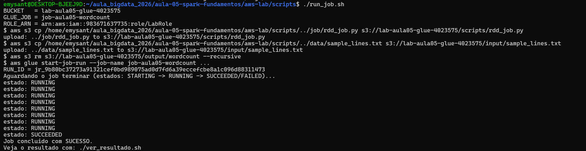

# Evidências — Lab Aula 05 (Spark RDDs na AWS)

## Identificação

- **Nome:** Emilly Santos de Oliveira
- **RA:** 4023575
- **Branch:** aula-05-4023575
- **Data:** 27/09/2026

---

## 1. Identidade AWS ativa

Saída de `aws sts get-caller-identity` (confirma que as credenciais do Learner
Lab estão ativas).

**Comando:**
```bash
aws sts get-caller-identity
```

Cole aqui a saída:


---

## 2. `terraform apply` concluído


---

## 3. Job com estado SUCCEEDED (Glue)

Print/saída final do `./run_job.sh` mostrando `estado: SUCCEEDED` e o `RUN_ID`.

**Onde:** `cd aula-05-spark-fundamentos/aws-lab/scripts && ./run_job.sh`

Cole aqui a saída:


---

## 4. Resultado do word count

Saída do `./ver_resultado.sh` (lista do output + conteúdo `palavra,contagem`).

**Onde:** `cd aula-05-spark-fundamentos/aws-lab/scripts && ./ver_resultado.sh`

Cole aqui a saída:
BUCKET = lab-aula05-glue-4023575
$ aws s3 ls s3://lab-aula05-glue-4023575/output/wordcount/
2026-09-27 17:52:49        311 part-00000-a38d6032-bb60-48a9-b809-d0355274c449-c000.txt
2026-09-27 17:52:49        377 part-00001-a38d6032-bb60-48a9-b809-d0355274c449-c000.txt
2026-09-27 17:52:49        377 part-00002-a38d6032-bb60-48a9-b809-d0355274c449-c000.txt
2026-09-27 17:52:49        394 part-00003-a38d6032-bb60-48a9-b809-d0355274c449-c000.txt
=== Conteudo do word count (palavra,contagem) ===
$ aws s3 cp --recursive s3://lab-aula05-glue-4023575/output/wordcount/ /tmp/tmp.WLlKNOlhy1
download: s3://lab-aula05-glue-4023575/output/wordcount/part-00002-a38d6032-bb60-48a9-b809-d0355274c449-c000.txt to ../../../../../../tmp/tmp.WLlKNOlhy1/part-00002-a38d6032-bb60-48a9-b809-d0355274c449-c000.txt
download: s3://lab-aula05-glue-4023575/output/wordcount/part-00000-a38d6032-bb60-48a9-b809-d0355274c449-c000.txt to ../../../../../../tmp/tmp.WLlKNOlhy1/part-00000-a38d6032-bb60-48a9-b809-d0355274c449-c000.txt
download: s3://lab-aula05-glue-4023575/output/wordcount/part-00001-a38d6032-bb60-48a9-b809-d0355274c449-c000.txt to ../../../../../../tmp/tmp.WLlKNOlhy1/part-00001-a38d6032-bb60-48a9-b809-d0355274c449-c000.txt
download: s3://lab-aula05-glue-4023575/output/wordcount/part-00003-a38d6032-bb60-48a9-b809-d0355274c449-c000.txt to ../../../../../../tmp/tmp.WLlKNOlhy1/part-00003-a38d6032-bb60-48a9-b809-d0355274c449-c000.txt
o,60
a,22
e,19
pedido,19
cliente,18
entrega,17
do,16
produto,16
estoque,14
pagamento,11
com,9
de,8
um,7
para,6
cada,5
dia,5
mais,5
que,5
ao,4
foi,4
grande,4
novo,4
pediu,4
da,3
muitos,3
na,3
pedidos,3
pelo,3
voltou,3
antes,2
apos,2
cartao,2
chegou,2
em,2
expressa,2
fez,2
ficou,2
fila,2
fim,2
interior,2
loja,2
no,2
pix,2
prazo,2
reembolso,2
saiu,2
abastece,1
abriu,1
aceitou,1
acompanhou,1
agiliza,1
agrada,1
analise,1
antigo,1
aplicativo,1
aprova,1
aprovou,1
area,1
as,1
assim,1
atencao,1
avaliou,1
aviso,1
avisou,1
buscou,1
caiu,1
caminho,1
central,1
cidade,1
codigo,1
combinado,1
comeca,1
compra,1
conferir,1
confirma,1
confirmou,1
contou,1
cuidado,1
custa,1
datas,1
dentro,1
dessa,1
devolvido,1
diferentes,1
dividida,1
dois,1
duas,1
durante,1
elogiou,1
embalado,1
emitida,1
entende,1
entra,1
entregador,1
entregues,1
equipe,1
escolheu,1
esta,1
estava,1
exigente,1
exigiu,1
favorito,1
fechou,1
feito,1
feliz,1
fiscal,1
gestor,1
hora,1
leva,1
liberou,1
liga,1
limite,1
lojas,1
maior,1
manha,1
mas,1
mostrou,1
nota,1
online,1
outro,1
pagou,1
parado,1
parcelado,1
partes,1
pela,1
por,1
poucas,1
prepara,1
produtos,1
quando,1
quase,1
rapida,1
rapido,1
rastreio,1
recebe,1
receber,1
recusado,1
reduziu,1
relatorio,1
repos,1
reposicao,1
reserva,1
retornou,1
revisou,1
rota,1
sai,1
satisfeito,1
segue,1
separa,1
separacao,1
sistema,1
sucesso,1
tarde,1
tem,1
tempo,1
tentou,1
teve,1
time,1
troca,1
unidades,1
usaram,1
vai,1
varias,1
vendido,1
vez,1
vezes,1
via,1

---

## 5. Top palavras / interpretação

Cole o **TOP 5** do word count e escreva **2–3 frases** interpretando o resultado.

Top 5:
```text
o,60
a,22
e,19
pedido,19
cliente,18
```

Interpretação:

> Desconsiderando os artigos e conjunções ("o", "a", "e"), as palavras de maior frequência são **pedido** (19), **cliente** (18), **entrega** (17) e **produto** (16), revelando que o texto simula o fluxo operacional de uma loja de e-commerce — do momento em que o cliente realiza um pedido até a entrega do produto. O driver (SparkContext) coordenou a divisão do texto em partições e distribuiu o processamento entre os executors, que aplicaram em paralelo as transformações `flatMap` (tokenização) e `map` (par palavra/1); a ação `reduceByKey` consolidou as contagens parciais de cada executor em um resultado final, demonstrando na prática o modelo de processamento distribuído de RDDs.

---

## 6. Logs do driver (opcional / bônus)

Print dos logs do **driver** no **CloudWatch** (grupo `/aws-glue/jobs/output`)
mostrando o `print(...)` do `rdd_job.py`.

**Onde:** AWS Glue → Jobs → seu job → aba **Runs** → selecione o run → **Output logs**

Print:


---

## 7. Limpeza (`terraform destroy`)

Print/trecho do `terraform destroy` com **"Destroy complete!"** confirmando que os
recursos foram removidos.

**Onde:** `cd aula-05-spark-fundamentos/aws-lab/infra && terraform destroy`

Cole aqui a saída:


---

## Checklist de conferência

- [x] 1. Identidade AWS ativa (`aws sts get-caller-identity`)
- [x] 2. `terraform apply` concluído ("Apply complete!" + outputs)
- [x] 3. Job com estado `SUCCEEDED` (Glue) (+ `RUN_ID`)
- [x] 4. Resultado do word count (`./ver_resultado.sh`)
- [x] 5. Top palavras + interpretação (2–3 frases)
- [x] 6. Logs do driver (opcional / bônus)
- [x] 7. Limpeza com `terraform destroy` ("Destroy complete!")
