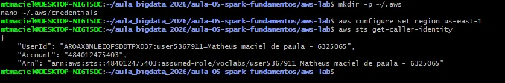
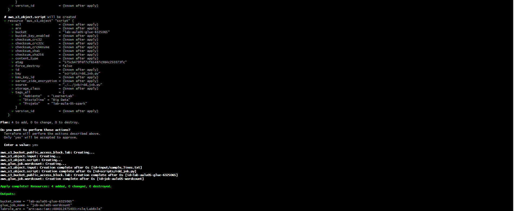
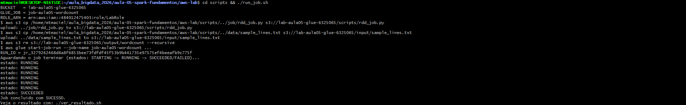
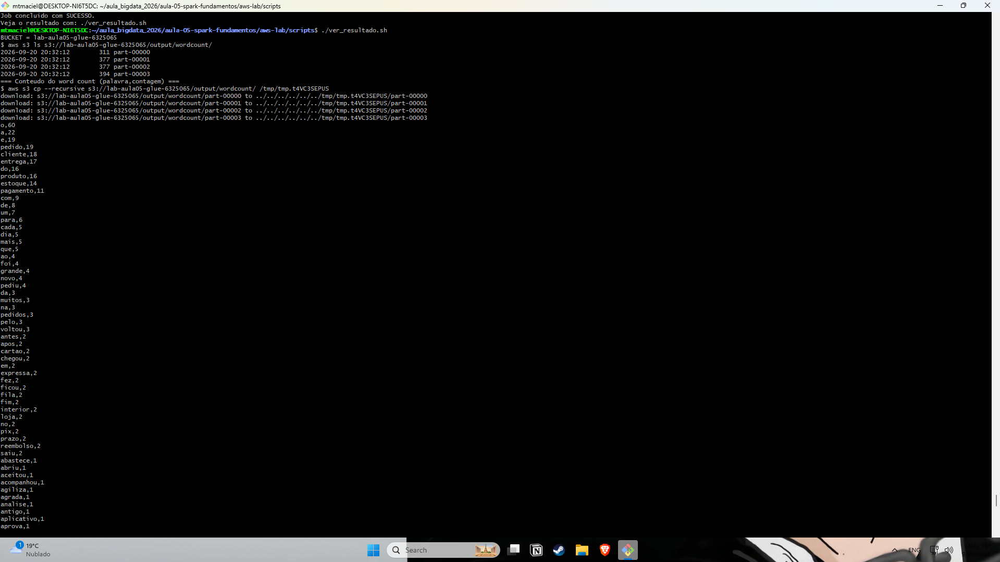
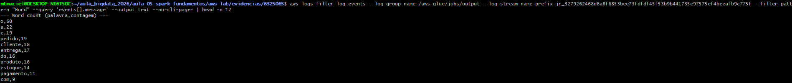
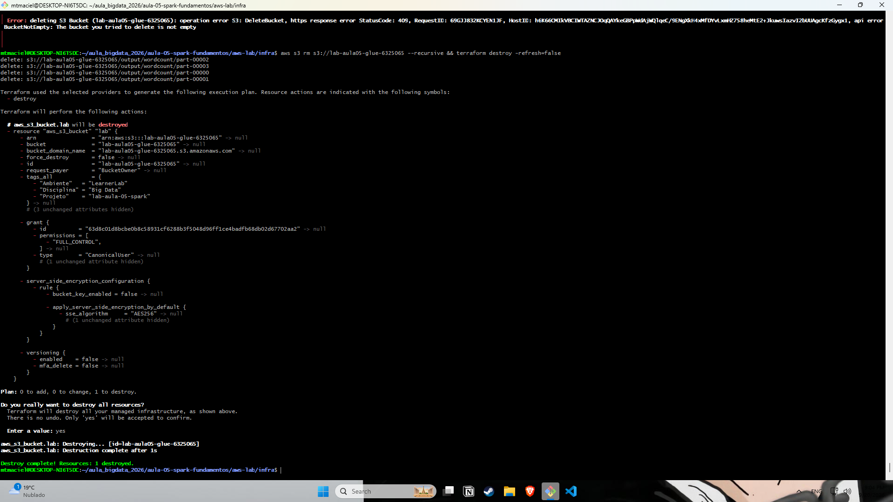

# Evidências — Lab Aula 05 (Spark RDDs na AWS)

## Identificação

- **Nome:** Matheus Maciel de Paula
- **RA:** 6325065
- **Branch:** aula-05-aws-6325065
- **Data:** 2026-09-20

---

## 1. Identidade AWS ativa

**Comando:** `aws sts get-caller-identity`

Saída (Account e UserId mascarados):

~~~text
{
    "UserId": "AROA...:user5367911=Matheus_maciel_de_paula_-_6325065",
    "Account": "XXXXXXXXXXXX",
    "Arn": "arn:aws:sts::XXXXXXXXXXXX:assumed-role/voclabs/user5367911=Matheus_maciel_de_paula_-_6325065"
}
~~~

---

## 2. `terraform apply` concluído

**Onde:** `cd aws-lab/infra && terraform apply -refresh=false`

Observação: o primeiro `apply` criou o bucket, mas parou por causa de uma SCP do Learner Lab. O contorno está na seção "Problemas encontrados" no final deste arquivo.

~~~text
Apply complete! Resources: 4 added, 0 changed, 0 destroyed.

Outputs:

bucket_nome = "lab-aula05-glue-6325065"
glue_job_nome = "job-aula05-wordcount"
labrole_arn = "arn:aws:iam::XXXXXXXXXXXX:role/LabRole"
~~~

---

## 3. Job com estado SUCCEEDED (Glue)

**Onde:** `cd aws-lab/scripts && ./run_job.sh`

~~~text
RUN_ID = jr_3279262468d8a8f6853bee73fdfdf45f53b9b441735e97575ef4beeafb9c775f
estado: SUCCEEDED
Job concluido com SUCESSO.
~~~

---

## 4. Resultado do word count

**Onde:** `cd aws-lab/scripts && ./ver_resultado.sh`

O `saveAsTextFile` gerou 4 arquivos (`part-00000` a `part-00003`), um por partição do RDD. Primeiras linhas do conteúdo (lista completa no print):

~~~text
o,60
a,22
e,19
pedido,19
cliente,18
entrega,17
do,16
produto,16
estoque,14
pagamento,11
com,9
de,8
um,7
para,6
cada,5
~~~

---

## 5. Top palavras / interpretação

Top 5:

~~~text
o,60
a,22
e,19
pedido,19
cliente,18
~~~

Interpretação:

> O texto trata do fluxo de uma loja online: as palavras de conteúdo mais frequentes são pedido (19), cliente (18), entrega (17), produto (16) e estoque (14). O topo da lista, porém, é dominado por artigos e conjunções (o, a, e), que não carregam significado; um filtro de stopwords resolveria isso. Como o código só converte para minúsculas e separa por espaço, "pedido" (19) e "pedidos" (3) são contados separadamente. Em termos de Spark, o driver criou o RDD com `sc.parallelize` e coordenou `flatMap`, `map` e `reduceByKey`, enquanto os executors processaram as partições em paralelo; por isso a saída foi gravada em 4 arquivos, um por partição.

---

## 6. Logs do driver (opcional / bônus)

---

## 7. Limpeza (`terraform destroy`)

**Onde:** `cd aws-lab/infra && terraform destroy -refresh=false`

~~~text
aws_s3_bucket.lab: Destroying... [id=lab-aula05-glue-6325065]
Error: deleting S3 Bucket: api error BucketNotEmpty: The bucket you tried to delete is not empty

(esvaziado com: aws s3 rm s3://lab-aula05-glue-6325065 --recursive)

aws_s3_bucket.lab: Destruction complete after 1s
Destroy complete! Resources: 1 destroyed.
~~~

Na primeira execução, 4 dos 5 recursos foram destruídos (Glue Job, 2 objetos, bloqueio de acesso público). O bucket falhou por conter a saída do job (`output/wordcount/`), foi esvaziado com `aws s3 rm --recursive` e o segundo destroy removeu o bucket.

---

## Problemas encontrados e soluções

**1. SCP do Learner Lab bloqueia a leitura do Object Lock do bucket.**
O `terraform apply` criou o bucket, mas falhou em seguida com `AccessDenied ... s3:GetBucketObjectLockConfiguration ... explicit deny in a service control policy`. É uma negação explícita da organização do Academy, não falta de permissão da LabRole. O provider AWS 5.x lê essa configuração logo após criar o bucket, e o recurso ficou marcado como tainted. Contorno: `terraform untaint aws_s3_bucket.lab` e depois `terraform apply -refresh=false` (e `-refresh=false` também no `destroy`).

**2. `saveAsTextFile` falhou no Glue com `ClassNotFoundException: org.apache.hadoop.mapred.DirectOutputCommitter`.**
O runtime do Glue aponta o committer da API antiga (`mapred`) para uma classe que não existe nele. Contorno: no `main()` de `rdd_job.py`, configurar `mapred.output.committer.class` como `org.apache.hadoop.mapred.FileOutputCommitter` via `sc._jsc.hadoopConfiguration()`, antes de gravar. O restante do template ficou intacto.

**3. `terraform destroy` falhou com `BucketNotEmpty`.**
O bucket ainda continha a saída do job. Solução: `aws s3 rm s3://lab-aula05-glue-6325065 --recursive` e depois `terraform destroy -refresh=false` de novo.
