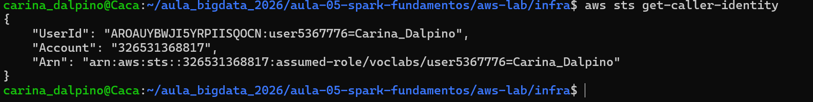
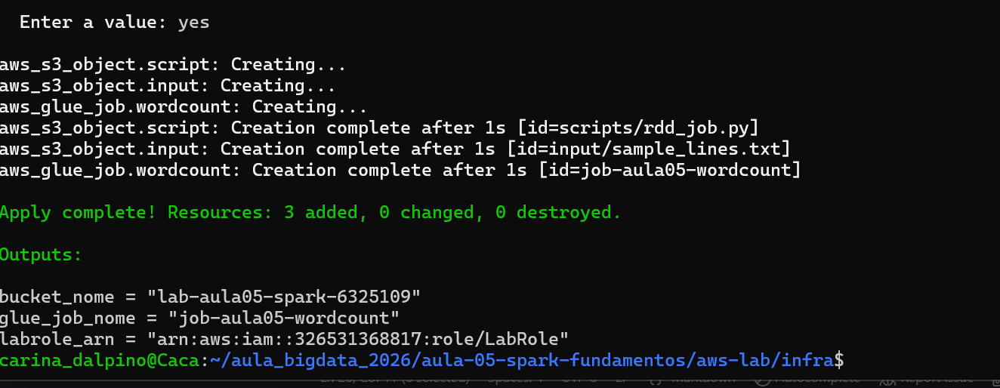
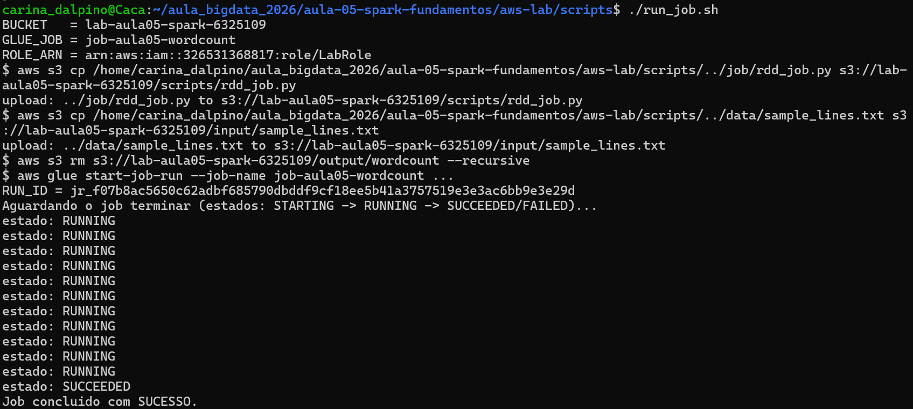
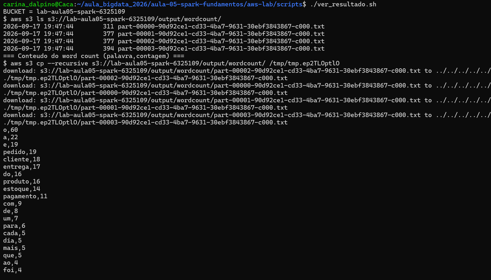
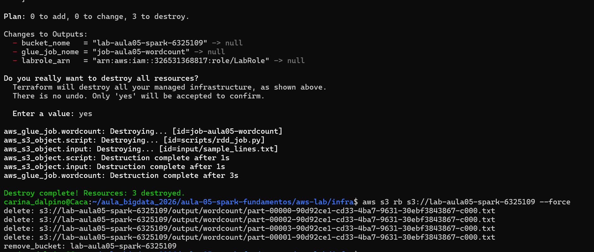

# Evidências — Lab Aula 05 (Spark RDDs na AWS)

## Identificação

- **Nome:** Carina Dalpino
- **RA:** 6325109
- **Branch:** aula-05-aws-6325109
- **Data:** 17/09/2026

---

## 1. Identidade AWS ativa

Saída de `aws sts get-caller-identity` (confirma que as credenciais do Learner
Lab estão ativas). Cole a saída no bloco de código abaixo (pode mascarar o
`Account`/`UserId`).

**Comando:**
```bash
aws sts get-caller-identity

```

Cole aqui a saída:
```text
(cole a saída aqui)
```


Print (opcional):
```

```

---

## 2. `terraform apply` concluído

Print ou trecho final do `terraform apply` mostrando **"Apply complete!"** e os
outputs (`bucket_nome`, `glue_job_nome`, `labrole_arn`). **NÃO** mostre credenciais.

**Onde:** `cd aws-lab/infra && terraform apply`

Cole aqui a saída:
```text
(cole a saída aqui)
```


Print:
```

```

---

## 3. Job com estado SUCCEEDED (Glue)

Print/saída final do `./run_job.sh` mostrando `estado: SUCCEEDED` e o `RUN_ID`.
(Alternativa: print do console **AWS Glue → Jobs → seu job → aba Runs** com status
**Succeeded**.)

**Onde:** `cd aws-lab/scripts && ./run_job.sh`

Cole aqui a saída:
```text
(cole a saída aqui)
```


Print:
```

```

---

## 4. Resultado do word count

Saída do `./ver_resultado.sh` (lista do output + conteúdo `palavra,contagem`).
Cole no bloco de código abaixo.

**Onde:** `cd aws-lab/scripts && ./ver_resultado.sh`

Cole aqui a saída:
```text
o,60
a,22
e,19
pedido,19
cliente,18
entrega,17
do,16
produto,16
estoque,14
pagamento,11
com,9
de,8
um,7
para,6
cada,5
dia,5
mais,5
que,5
ao,4
foi,4
grande,4
novo,4
pediu,4
da,3
muitos,3
na,3
pedidos,3
pelo,3
voltou,3
(... palavras com contagem 2 e 1 omitidas por brevidade ...)
```


Print (opcional):
```

```

---

## 5. Top palavras / interpretação

Cole o **TOP 5** do word count e escreva **2–3 frases** interpretando o resultado
(ex.: por que "pedido/cliente/entrega" dominam, o que isso diz sobre o texto de
e-commerce). Relacione com os conceitos de **RDD / driver / executors** da aula.

Top 5 (palavras de conteúdo, excluindo artigos/preposições como "o", "a", "e", "do"):
```text
pedido,19
cliente,18
entrega,17
produto,16
estoque,14
```

Interpretação:

> As palavras mais frequentes — pedido, cliente, entrega, produto e estoque —
> resumem o fluxo central de uma operação de e-commerce: o cliente faz um
> pedido, o produto sai do estoque e a entrega é realizada. Isso mostra que a
> contagem por frequência captura bem o "assunto" dominante do texto, já que os
> termos de negócio se repetem em quase toda linha. No processamento, cada
> executor contou as palavras de uma partição do RDD em paralelo (map →
> reduceByKey), e o driver agregou os resultados parciais e ordenou a contagem
> final — exatamente o modelo de RDD/driver/executors da aula, só que rodando
> no Spark gerenciado do AWS Glue em vez de na máquina local.

---

## 6. Logs do driver (opcional / bônus)

Print dos logs do **driver** no **CloudWatch** (grupo `/aws-glue/jobs/output`)
mostrando o `print(...)` do `rdd_job.py`.

**Onde:** AWS Glue → Jobs → seu job → aba **Runs** → selecione o run → **Output logs**
(abre o CloudWatch no grupo `/aws-glue/jobs/output`).

Print:
```

```

---

## 7. Limpeza (`terraform destroy`)

Print/trecho do `terraform destroy` com **"Destroy complete!"** confirmando que os
recursos foram removidos (guardrail de custo).

**Onde:** `cd aws-lab/infra && terraform destroy`

Cole aqui a saída:
```text
(cole a saída aqui)
```

Print:
```

```

---

## Checklist de conferência

- [ ] 1. Identidade AWS ativa (`aws sts get-caller-identity`)
- [ ] 2. `terraform apply` concluído ("Apply complete!" + outputs)
- [ ] 3. Job com estado `SUCCEEDED` (Glue) (+ `RUN_ID`)
- [ ] 4. Resultado do word count (`./ver_resultado.sh`)
- [ ] 5. Top palavras + interpretação (2–3 frases)
- [ ] 6. Logs do driver (opcional / bônus)
- [ ] 7. Limpeza com `terraform destroy` ("Destroy complete!")
