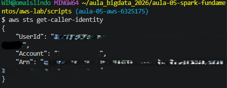
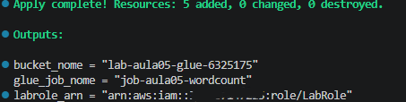
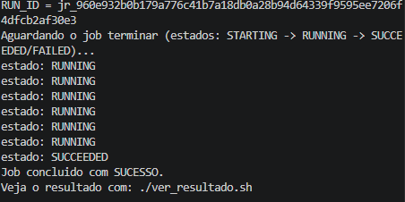
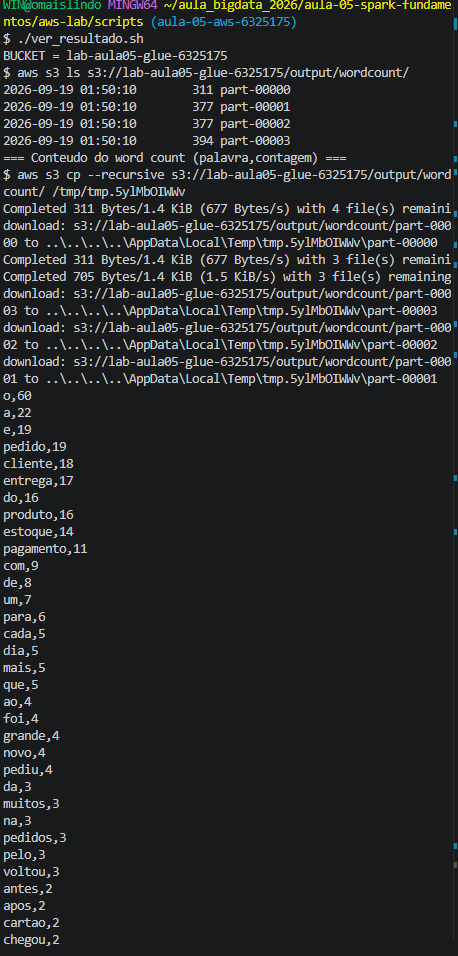
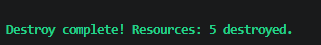

# Evidências — Lab Aula 05 (Spark RDDs na AWS)

> Copie este arquivo para `evidencias/<SEU_RA>/EVIDENCIAS.md` e preencha.
> Salve os prints na mesma pasta e referencie-os no texto.

## Identificação

- **Nome:** João Pedro Paulino Ferreira
- **RA:** 6325175
- **Branch:** aula-05-aws-6325175
- **Data:** 19/09/2026

---

## 1. Identidade AWS ativa

Saída de `aws sts get-caller-identity` (confirma que as credenciais do Learner
Lab estão ativas). Cole a saída no bloco de código abaixo (pode mascarar o
`Account`/`UserId`).

**Comando:**
```bash
aws sts get-caller-identity
```

Cole aqui a saída:
```text
(aws sts get-caller-identity
{                                                         
    "UserId": "-",
    "Account": "-",
    "Arn": "arn:aws:sts::-:assumed-role/voclabs/"
})
```

Print (opcional):
```

```

---

## 2. `terraform apply` concluído

Print ou trecho final do `terraform apply` mostrando **"Apply complete!"** e os
outputs (`bucket_nome`, `glue_job_nome`, `labrole_arn`). **NÃO** mostre credenciais.

**Onde:** `cd aws-lab/infra && terraform apply`

Cole aqui a saída:
```text
(Apply complete! Resources: 5 added, 0 changed, 0 destroyed.

Outputs:

bucket_nome = "lab-aula05-glue-6325175"
glue_job_nome = "job-aula05-wordcount"
labrole_arn = "arn:aws:iam:::role/LabRole")
```

Print:
```

```

---

## 3. Job com estado SUCCEEDED (Glue)

Print/saída final do `./run_job.sh` mostrando `estado: SUCCEEDED` e o `RUN_ID`.
(Alternativa: print do console **AWS Glue → Jobs → seu job → aba Runs** com status
**Succeeded**.)

**Onde:** `cd aws-lab/scripts && ./run_job.sh`

Cole aqui a saída:
```text
(Aguardando o job terminar (estados: STARTING -> RUNNING -> SUCCEEDED/FAILED)...
estado: RUNNING
estado: RUNNING
estado: RUNNING
estado: RUNNING
estado: RUNNING
estado: RUNNING
estado: SUCCEEDED
Job concluido com SUCESSO.)
```

Print:
```

```

---

## 4. Resultado do word count

Saída do `./ver_resultado.sh` (lista do output + conteúdo `palavra,contagem`).
Cole no bloco de código abaixo.

**Onde:** `cd aws-lab/scripts && ./ver_resultado.sh`

Cole aqui a saída:
```text
(./ver_resultado.sh
BUCKET = lab-aula05-glue-6325175
$ aws s3 ls s3://lab-aula05-glue-6325175/output/wordcount/
2026-09-19 01:50:10        311 part-00000
2026-09-19 01:50:10        377 part-00001
2026-09-19 01:50:10        377 part-00002
2026-09-19 01:50:10        394 part-00003
=== Conteudo do word count (palavra,contagem) ===
$ aws s3 cp --recursive s3://lab-aula05-glue-6325175/output/wordcount/ /tmp/tmp.5ylMbOIWWv
Completed 311 Bytes/1.4 KiB (677 Bytes/s) with 4 file(s) remainidownload: s3://lab-aula05-glue-6325175/output/wordcount/part-00000 to ..\..\..\..\AppData\Local\Temp\tmp.5ylMbOIWWv\part-00000
Completed 311 Bytes/1.4 KiB (677 Bytes/s) with 3 file(s) remainiCompleted 705 Bytes/1.4 KiB (1.5 KiB/s) with 3 file(s) remainingdownload: s3://lab-aula05-glue-6325175/output/wordcount/part-00003 to ..\..\..\..\AppData\Local\Temp\tmp.5ylMbOIWWv\part-00003
download: s3://lab-aula05-glue-6325175/output/wordcount/part-00002 to ..\..\..\..\AppData\Local\Temp\tmp.5ylMbOIWWv\part-00002
download: s3://lab-aula05-glue-6325175/output/wordcount/part-00001 to ..\..\..\..\AppData\Local\Temp\tmp.5ylMbOIWWv\part-00001
o,60
a,22
e,19
pedido,19
cliente,18
entrega,17
do,16
produto,16
estoque,14
pagamento,11
com,9
de,8
um,7
para,6
cada,5
dia,5
mais,5
que,5
ao,4
foi,4
grande,4
novo,4
pediu,4
da,3
muitos,3
na,3
pedidos,3
pelo,3
voltou,3
antes,2
apos,2
cartao,2
chegou,2
em,2
expressa,2
fez,2
ficou,2
fila,2
fim,2
interior,2
loja,2
no,2
pix,2
prazo,2
reembolso,2
saiu,2
abastece,1
abriu,1
aceitou,1
acompanhou,1
agiliza,1
agrada,1
analise,1
antigo,1
aplicativo,1
aprova,1
aprovou,1
area,1
as,1
assim,1
atencao,1
avaliou,1
aviso,1
avisou,1
buscou,1
caiu,1
caminho,1
central,1
cidade,1
codigo,1
combinado,1
comeca,1
compra,1
conferir,1
confirma,1
confirmou,1
contou,1
cuidado,1
custa,1
datas,1
dentro,1
dessa,1
devolvido,1
diferentes,1
dividida,1
dois,1
duas,1
durante,1
elogiou,1
embalado,1
emitida,1
entende,1
entra,1
entregador,1
entregues,1
equipe,1
escolheu,1
esta,1
estava,1
exigente,1
exigiu,1
favorito,1
fechou,1
feito,1
feliz,1
fiscal,1
gestor,1
hora,1
leva,1
liberou,1
liga,1
limite,1
lojas,1
maior,1
manha,1
mas,1
mostrou,1
nota,1
online,1
outro,1
pagou,1
parado,1
parcelado,1
partes,1
pela,1
por,1
poucas,1
prepara,1
produtos,1
quando,1
quase,1
rapida,1
rapido,1
rastreio,1
recebe,1
receber,1
recusado,1
reduziu,1
relatorio,1
repos,1
reposicao,1
reserva,1
retornou,1
revisou,1
rota,1
sai,1
satisfeito,1
segue,1
separa,1
separacao,1
sistema,1
sucesso,1
tarde,1
tem,1
tempo,1
tentou,1
teve,1
time,1
troca,1
unidades,1
usaram,1
vai,1
varias,1
vendido,1
vez,1
vezes,1
via,1)
```

Print (opcional):
```

```

---

## 5. Top palavras / interpretação

Cole o **TOP 5** do word count e escreva **2–3 frases** interpretando o resultado
(ex.: por que "pedido/cliente/entrega" dominam, o que isso diz sobre o texto de
e-commerce). Relacione com os conceitos de **RDD / driver / executors** da aula.

Top 5:
```text
(### Top 5 palavras

1. **o** — 60 ocorrências
2. **a** — 22 ocorrências
3. **e** — 19 ocorrências
4. **pedido** — 19 ocorrências
5. **cliente** — 18 ocorrências)
```

Interpretação:

> (O resultado mostra que os termos mais frequentes estão relacionados ao contexto de pedidos e operações de uma loja, com destaque para “pedido” e “cliente”, enquanto palavras funcionais como “o”, “a” e “e” apresentam alta frequência por serem comuns na língua portuguesa. O processamento foi realizado utilizando RDDs do Spark, com o driver coordenando a execução e os executors realizando o processamento distribuído dos dados.)

---

## 6. Logs do driver (opcional / bônus)

Print dos logs do **driver** no **CloudWatch** (grupo `/aws-glue/jobs/output`)
mostrando o `print(...)` do `rdd_job.py`.

**Onde:** AWS Glue → Jobs → seu job → aba **Runs** → selecione o run → **Output logs**
(abre o CloudWatch no grupo `/aws-glue/jobs/output`).

Print:
```

```

---

## 7. Limpeza (`terraform destroy`)

Print/trecho do `terraform destroy` com **"Destroy complete!"** confirmando que os
recursos foram removidos (guardrail de custo).

**Onde:** `cd aws-lab/infra && terraform destroy`

Cole aqui a saída:
```text
(terraform_data.s3_bucket: Destroying... [id=027467fc-99e2-8f84-0f7e-8e92f854ce0d]
terraform_data.s3_bucket: Destruction complete after 0s
aws_s3_bucket_public_access_block.lab: Destroying... [id=lab-aula05-glue-6325175]
aws_s3_object.script: Destroying... [id=scripts/rdd_job.py]
aws_s3_object.input: Destroying... [id=input/sample_lines.txt]
aws_glue_job.wordcount: Destroying... [id=job-aula05-wordcount]
aws_s3_object.input: Destruction complete after 1s
aws_s3_object.script: Destruction complete after 1s
aws_glue_job.wordcount: Destruction complete after 1s
aws_s3_bucket_public_access_block.lab: Destruction complete after 1s

Destroy complete! Resources: 5 destroyed.)
```

Print:
```

```

---

## Checklist de conferência

- [ ] 1. Identidade AWS ativa (`aws sts get-caller-identity`)
- [ ] 2. `terraform apply` concluído ("Apply complete!" + outputs)
- [ ] 3. Job com estado `SUCCEEDED` (Glue) (+ `RUN_ID`)
- [ ] 4. Resultado do word count (`./ver_resultado.sh`)
- [ ] 5. Top palavras + interpretação (2–3 frases)
- [ ] 6. Logs do driver (opcional / bônus)
- [ ] 7. Limpeza com `terraform destroy` ("Destroy complete!")
