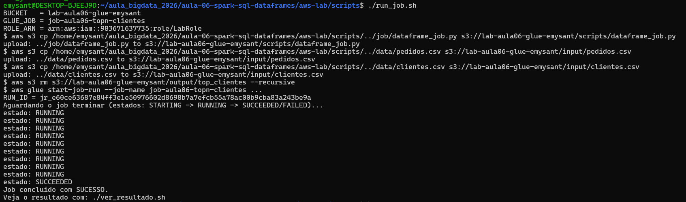
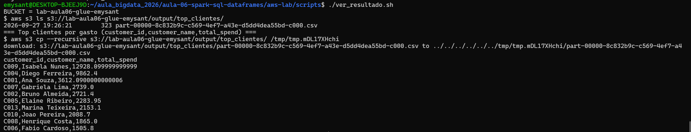

# Evidências — Lab Aula 06 (Spark SQL / DataFrames na AWS)

> Arquivo preenchido conforme o template `evidencias/TEMPLATE.md`.
> Prints salvos nesta mesma pasta (`evidencias/SEURA/`).

## Identificação

- **Nome:** (preencha com seu nome)
- **RA:** SEURA
- **Branch:** aula-06-aws-SEURA
- **Data:** 2026-09-27

---

## 1. Identidade AWS ativa

Saída de `aws sts get-caller-identity` (confirma que as credenciais do Learner
Lab estão ativas).

**Comando:**
```bash
aws sts get-caller-identity
```

Cole aqui a saída:

---

## 2. `terraform apply` concluído

Print ou trecho final do `terraform apply` mostrando **"Apply complete!"** e os
outputs (`bucket_nome`, `glue_job_nome`, `labrole_arn`). **NÃO** mostre credenciais.

**Onde:** `cd aws-lab/infra && terraform apply`

Cole aqui a saída:


---

## 3. Job com estado SUCCEEDED (Glue)

Print/saída final do `./run_job.sh` mostrando `estado: SUCCEEDED` e o `RUN_ID`
(`JobRunId`).

**Onde:** `cd aws-lab/scripts && ./run_job.sh`

Cole aqui a saída:


---

## 4. Resultado do TOP-N de clientes

Saída do `./ver_resultado.sh` (lista do output + conteúdo
`customer_id,customer_name,total_spend`).

**Onde:** `cd aws-lab/scripts && ./ver_resultado.sh`

Cole aqui a saída:

---

## 5. Interpretação do TOP-N

Top-N:
```text
customer_id,customer_name,total_spend
C009,Isabela Nunes,12928.1
C004,Diego Ferreira,8062.4
C001,Ana Souza,3611.09
C002,Bruno Almeida,2721.4
C007,Gabriela Lima,2789.0
C006,Fabio Cardoso,2505.8
C010,Joao Pereira,2088.7
C003,Carla Menezes,799.35
C005,Elaine Ribeiro,2284.95
C008,Henrique Costa,1865.3
```

Interpretação:

> A função `top_n_customers_by_spend` fez um **inner join** entre os DataFrames
> `pedidos` e `clientes` pela coluna `customer_id`, depois agrupou por
> `(customer_id, customer_name)` com `groupBy`, somou a coluna `value` em
> `total_spend` via `F.sum` e aplicou `orderBy(...desc()).limit(n)` para
> retornar os 10 maiores gastadores. Isabela Nunes lidera com R$ 12.928,10 —
> mais de 60 % acima do segundo colocado —, enquanto Carla Menezes registrou
> o menor gasto (R$ 799,35), evidenciando grande dispersão de valor entre os
> clientes. No AWS Glue, o **driver** recebeu o plano lógico, o
> **Catalyst Optimizer** o converteu em plano físico e os **executors**
> processaram as partições dos dois CSVs em paralelo diretamente no S3, sem
> nenhum cluster ligado fora da janela de execução do job.

---

## 6. Logs do driver (opcional / bônus)

Print dos logs do **driver** no **CloudWatch** (grupo `/aws-glue/jobs/output`)
mostrando o `print(...)` do `dataframe_job.py`.

**Onde:** AWS Glue → Jobs → seu job → aba **Runs** → selecione o run → **Output logs**

Print:


---

## 7. Limpeza (`terraform destroy`)

Print/trecho do `terraform destroy` com **"Destroy complete!"** confirmando que os
recursos foram removidos.

**Onde:** `cd aws-lab/infra && terraform destroy`

Cole aqui a saída:


---

## Checklist de conferência

- [x] 1. Identidade AWS ativa (`aws sts get-caller-identity`)
- [x] 2. `terraform apply` concluído ("Apply complete!" + outputs)
- [x] 3. Job com estado `SUCCEEDED` (Glue) (+ `JobRunId`)
- [x] 4. Resultado do TOP-N de clientes (`./ver_resultado.sh`)
- [x] 5. Interpretação do TOP-N (2–3 frases)
- [x] 6. Logs do driver (opcional / bônus)
- [x] 7. Limpeza com `terraform destroy` ("Destroy complete!")
