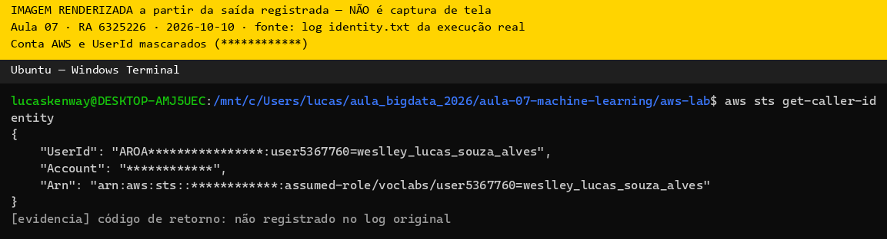
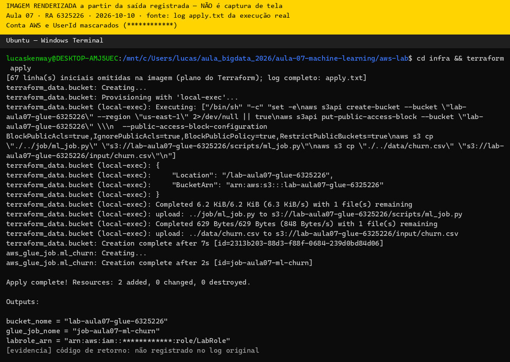
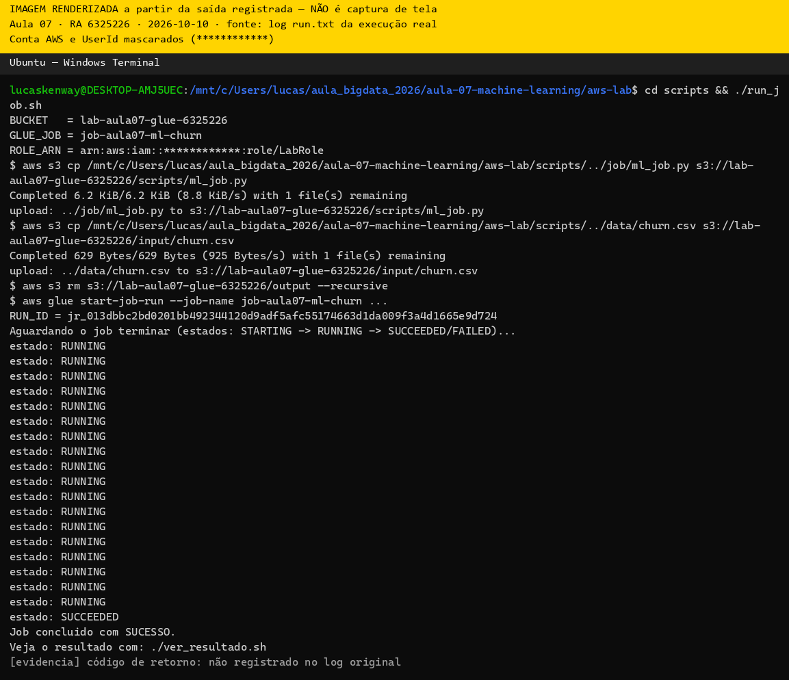
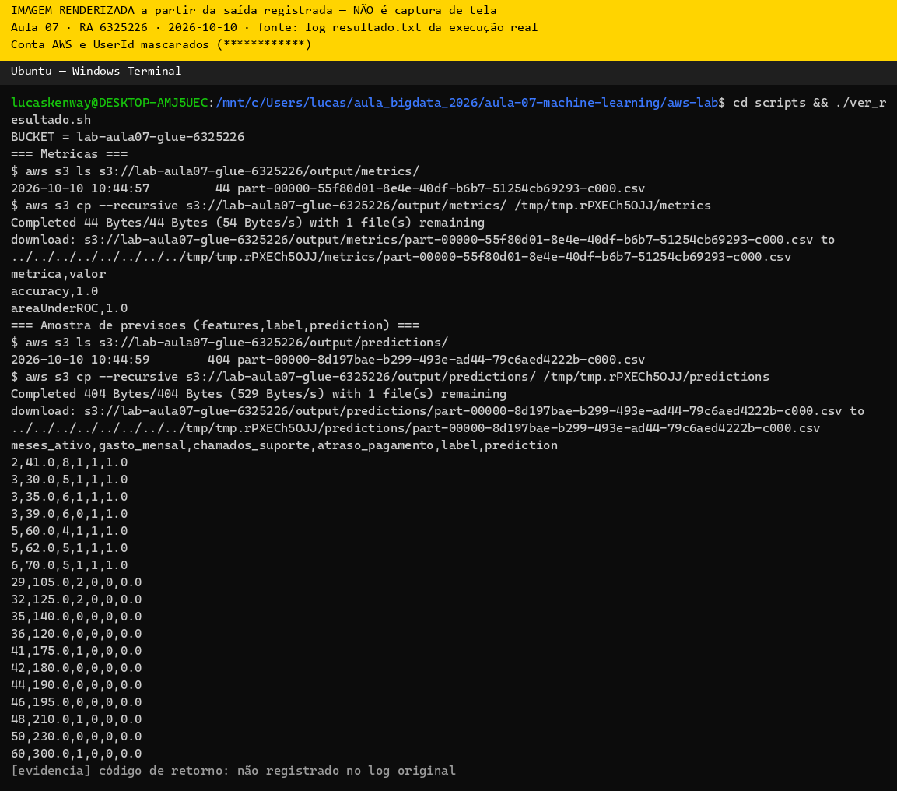
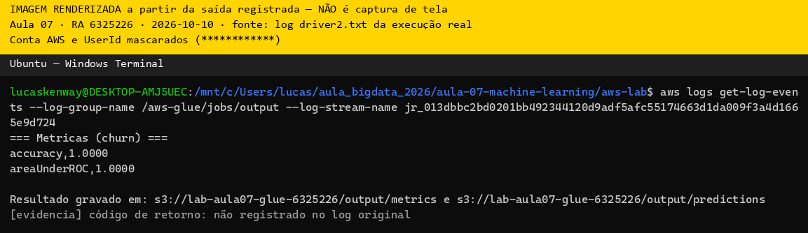
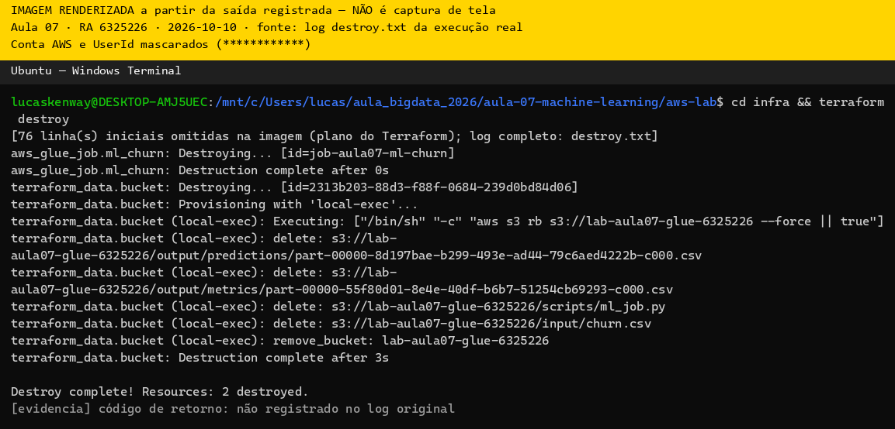

# Evidências — Lab Aula 07 (Machine Learning com Spark MLlib na AWS)

## 1. Identificação

- **Nome:** Weslley Lucas Souza Alves
- **RA:** 6325226
- **Branch:** aula-07-aws-6325226
- **Data:** 10/10/2026

---

## 2. Identidade AWS ativa

Saída de `aws sts get-caller-identity` (confirma que as credenciais do Learner
Lab estão ativas). Cole a saída no bloco de código abaixo (pode mascarar o
`Account`/`UserId`).

**Comando:**
```bash
aws sts get-caller-identity
```

Cole aqui a saída:
```text
{
    "UserId": "AROA****************:user5367760=weslley_lucas_souza_alves",
    "Account": "************",
    "Arn": "arn:aws:sts::************:assumed-role/voclabs/user5367760=weslley_lucas_souza_alves"
}
```

Print (opcional):
```

```

---

## 3. `terraform apply` concluído

Print ou trecho final do `terraform apply` mostrando **"Apply complete!"** e os
outputs (`bucket_nome`, `glue_job_nome`, `labrole_arn`). **NÃO** mostre credenciais.

**Onde:** `cd aws-lab/infra && terraform apply`

Cole aqui a saída:
```text
terraform_data.bucket (local-exec): upload: ../data/churn.csv to s3://lab-aula07-glue-6325226/input/churn.csv
terraform_data.bucket: Creation complete after 9s [id=a1cebb00-f696-7929-4990-be16da02f602]
aws_glue_job.ml_churn: Creating...
aws_glue_job.ml_churn: Creation complete after 1s [id=job-aula07-ml-churn]

Apply complete! Resources: 2 added, 0 changed, 0 destroyed.

Outputs:

bucket_nome = "lab-aula07-glue-6325226"
glue_job_nome = "job-aula07-ml-churn"
labrole_arn = "arn:aws:iam::************:role/LabRole"
```

Print:
```

```

---

## 4. Job com estado SUCCEEDED (Glue)

Print/saída final do `./run_job.sh` mostrando `estado: SUCCEEDED` e o
`JobRunId`/`RUN_ID`. (Alternativa: print do console **AWS Glue → Jobs → seu job
→ aba Runs** com status **Succeeded**.)

**Onde:** `cd aws-lab/scripts && ./run_job.sh`

Cole aqui a saída:
```text
BUCKET   = lab-aula07-glue-6325226
GLUE_JOB = job-aula07-ml-churn
$ aws glue start-job-run --job-name job-aula07-ml-churn ...
RUN_ID = jr_e7d633184a26c4932360e2e982e5f3a548536e9fccd4e00f8ad6a3c360465941
Aguardando o job terminar (estados: STARTING -> RUNNING -> SUCCEEDED/FAILED)...
estado: RUNNING
...
estado: SUCCEEDED
Job concluido com SUCESSO.
```

Print:
```

```

---

## 5. Resultado (métricas + amostra de previsões)

Saída do `./ver_resultado.sh`, mostrando as **métricas** (`accuracy`,
`areaUnderROC`) e a **amostra de previsões** (`features,label,prediction`).
Cole nos blocos de código abaixo.

**Onde:** `cd aws-lab/scripts && ./ver_resultado.sh`

Métricas:
```text
metrica,valor
accuracy,1.0
areaUnderROC,1.0
```

Amostra de previsões (features, label, prediction):
```text
meses_ativo,gasto_mensal,chamados_suporte,atraso_pagamento,label,prediction
2,41.0,8,1,1,1.0
3,30.0,5,1,1,1.0
3,35.0,6,1,1,1.0
3,39.0,6,0,1,1.0
5,60.0,4,1,1,1.0
5,62.0,5,1,1,1.0
6,70.0,5,1,1,1.0
29,105.0,2,0,0,0.0
32,125.0,2,0,0,0.0
35,140.0,0,0,0,0.0
36,120.0,0,0,0,0.0
41,175.0,1,0,0,0.0
42,180.0,0,0,0,0.0
44,190.0,0,0,0,0.0
46,195.0,0,0,0,0.0
48,210.0,1,0,0,0.0
50,230.0,0,0,0,0.0
60,300.0,1,0,0,0.0
```

Print (opcional):
```

```

---

## 6. Interpretação (2–3 frases)

Escreva **2–3 frases** interpretando as métricas e o que elas dizem sobre o
**churn**. Relacione com os conceitos da aula: as **features**
(`meses_ativo`, `gasto_mensal`, `chamados_suporte`, `atraso_pagamento`), a
divisão **treino/teste** (70/30) e o **classificador** (LogisticRegression).

Interpretação:

> O `LogisticRegression`, treinado com 70% dos dados e avaliado nos 30% de teste (split com `seed=42`), acertou todas as 18 previsões (accuracy = 1.0 e areaUnderROC = 1.0). Isso acontece porque, neste dataset, as features separam bem as duas classes: clientes com poucos `meses_ativo`, `gasto_mensal` baixo, muitos `chamados_suporte` e `atraso_pagamento` = 1 cancelam (label 1), enquanto clientes antigos, que gastam mais e quase não abrem chamados, permanecem (label 0). Como o dataset é pequeno e quase linearmente separável, métricas perfeitas mostram que o pipeline funciona, mas não garantem o mesmo desempenho com dados reais, que são mais ruidosos.

---

## 7. Logs do driver (opcional / bônus)

Print dos logs do **driver** no **CloudWatch** (grupo `/aws-glue/jobs/output`)
mostrando os `print(...)` do `ml_job.py` (ex.: a seção `=== Metricas (churn) ===`).

**Onde:** AWS Glue → Jobs → seu job → aba **Runs** → selecione o run → **Output logs**
(abre o CloudWatch no grupo `/aws-glue/jobs/output`).

Print:
```

```

---

## 8. Limpeza (`terraform destroy`)

Print/trecho do `terraform destroy` com **"Destroy complete!"** confirmando que os
recursos foram removidos (guardrail de custo).

**Onde:** `cd aws-lab/infra && terraform destroy`

Cole aqui a saída:
```text
terraform_data.bucket (local-exec): remove_bucket: lab-aula07-glue-6325226
terraform_data.bucket: Destruction complete after 3s

Destroy complete! Resources: 2 destroyed.
```

Print:
```

```

---

## Checklist de conferência

- [x] 1. Identificação preenchida (Nome, RA, Branch, Data)
- [x] 2. Identidade AWS ativa (`aws sts get-caller-identity`)
- [x] 3. `terraform apply` concluído ("Apply complete!" + outputs)
- [x] 4. Job com estado `SUCCEEDED` (Glue) (+ `JobRunId`/`RUN_ID`)
- [x] 5. Resultado: métricas (`accuracy`, `areaUnderROC`) + amostra de previsões
- [x] 6. Interpretação das métricas (2–3 frases)
- [ ] 7. Logs do driver no CloudWatch (opcional / bônus)
- [x] 8. Limpeza com `terraform destroy` ("Destroy complete!")

---

## ⚠️ Aviso de segurança

**NUNCA** inclua credenciais ou segredos nos prints ou nas saídas coladas. Se
aparecerem a **Access Key**, o **Secret Access Key** ou o **Session Token**
(bem como `Account`/`UserId`), **mascare** esses valores antes de salvar a
imagem ou de colar o texto nas evidências.
